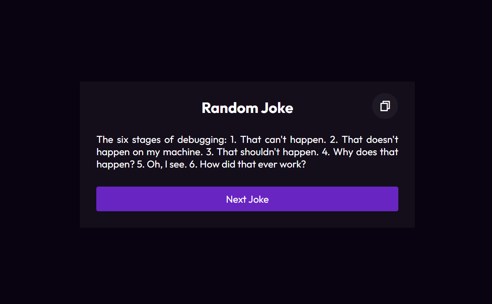

# Random Joke Generator

Welcome to the Random Joke Generator repository! This project is a JavaScript-based web application designed to generate random jokes from a joke API. Built with HTML, CSS, and JavaScript, it features a modern UI design for an intuitive and user-friendly experience. The app allows users to fetch and display jokes with the option to copy them for sharing.

## Preview



## Features

- **Random Jokes:** Fetch and display jokes from a joke API.
- **Copy Functionality:** Easily copy jokes for sharing with friends.
- **Modern UI Design:** Sleek layout and visually appealing design for an enjoyable user interface.

## Getting Started

To run the Random Joke Generator locally, follow these steps:

1. Clone the repository to your local machine:

   ```bash
   git clone https://github.com/Devsethi3/Random-Joke-Generator.git
   ```

2. Open the `index.html` file in your preferred web browser.

## Usage

1. Click the "Generate Joke" button to fetch and display a random joke.
2. Use the "Copy Joke" button to copy the displayed joke to the clipboard.

## API Used

This project utilizes the [JokeAPI](https://v2.jokeapi.dev/) to fetch random jokes.

## Customization

Feel free to customize this project to fit your preferences. Update styles, colors, and layout in the HTML and CSS files. You can also explore other joke APIs or extend the functionality to include additional features.

## Contributing

If you'd like to contribute to this project, please follow these steps:

1. Fork the repository.
2. Create a new branch for your feature or improvement.
3. Make your changes and commit them with descriptive messages.
4. Push your changes to your forked repository.
5. Open a pull request to merge your changes into the main branch.

Explore the Random Joke Generator, have a good laugh, and consider contributing to its development. Thank you for checking out the repository!